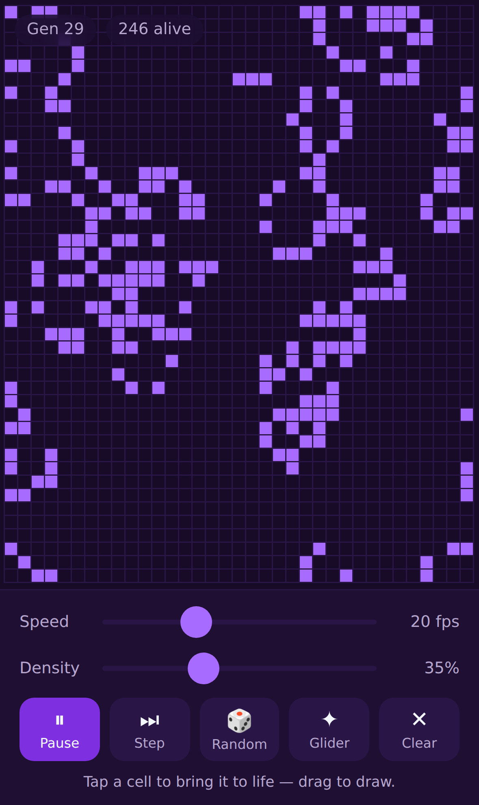

# Conway's Game of Life
### Built with 🦀🕸, and ready for your phone

The simulation is Rust compiled to WebAssembly; the front end is a touch-first
web app that installs to an iPhone home screen or wraps into a native app.

**▶︎ Play it: <https://arnauddc807.github.io/Conways-Wasm-of-Rust/>**

Open that on an iPhone in Safari and use **Share → Add to Home Screen** to
install it as an app.

made using [wasm-pack](https://github.com/rustwasm/wasm-pack) & [create-wasm-app](https://github.com/rustwasm/create-wasm-app)



Tap a cell to bring it to life, drag to draw a pattern, and set it running. The
grid fits itself to whatever screen it lands on, survives a rotation without
losing the pattern, follows the system light/dark setting, and works offline.

## Usage

### 🛠️ Build the wasm binary
```
wasm-pack build
```

### 📁 Step into the www directory
```
cd www/
```

### 🚩 Start npm
```
npm install
npm start
```

The dev server listens on every interface, so `http://<your-LAN-IP>:8080` opens
it on a phone on the same Wi-Fi — worth doing, since touch behaviour is not
something a desktop browser reproduces faithfully.

### 📦 Build for release
```
npm run build
```

Produces a self-contained static site in `www/dist/`.

## 📱 Putting it on an iPhone

Two routes, both covered in **[docs/IOS.md](docs/IOS.md)**:

- **Add to Home Screen** from Safari — full-screen, offline-capable, its own
  icon, and no Mac or developer account needed.
- **A native app via [Capacitor](https://capacitorjs.com)** — a real Xcode
  project you can push to TestFlight and the App Store. `npm run ios:add`, then
  `npm run ios:open`.

## 🧪 Tests
```
cargo test
```

The rules of the game — oscillators, still lifes, the glider, edge wrapping —
are covered by native unit tests, so they run without a browser.
